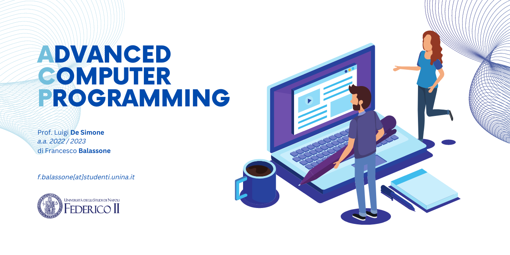

# Advanced Computer Programming
## di Francesco Balassone
prof. Luigi De Simone 
a.a. 2022 / 2023 
f.balassone@studenti.unina.it 
[Sintesi Teoria Corso](https://francescobalassone.notion.site/ACP-76da4429e929488bb82a4448679ff98e)

